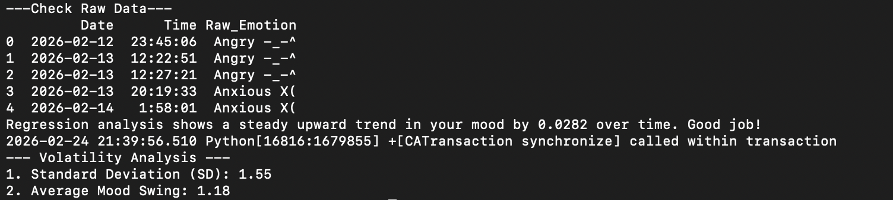

# Mood-Analytics: Descriptive Statistics of My (Rollercoasting) Moods




## 0. Introduction: The Science of "Me"
Data is most powerful when it reveals the uncomfortable truth. While the **Pico W Mood-Tracker** device focuses on the tactile "Click" to capture fleeting moments of joy or existential dread, this project applies rigorous descriptive statistics to analyze the wreckage.

We aren't just looking at feelings; we are calculating the mean, variance, and emotional trajectory of a human being who probably needs a nap.

### Project Ecosystem
This analytics suite is the second half of a two-part ecosystem:
1. **The Logger ([PicoW-Mood-Tracker](https://github.com/KELEE0810/pico-w-mood-tracker))**: An IoT device that logs moods to Google Sheets.
2. **The Analyzer (This Repo)**: A Python-based suite that fetches, processes, and visualizes that data.

---

## 1. Key Analytical Features

### 1. Trend Forecasting (Linear Regression)


By mapping qualitative mood labels to quantitative scores, the system calculates a **Regression Slope** to determine your emotional trajectory over time.
* **Positive Slope**: Indicates a steady upward trend in your well-being. **Negative Slope**: Suggests a downward trend, signaling a need for rest.
* Or just calculating if my happiness is trending upward or if I'm headed for a statistical anomaly.


### 2. Emotional Volatility Analysis


This script analyzes the stability of your emotions through advanced statistical metrics:
* **Standard Deviation (SD)**: Measures how much your mood scores deviate from the average.
* **Average Mood Swing**: Calculates the mean of absolute differences between consecutive records to quantify emotional turbulence.
* **Volatility Visualization (VIX)**: A dedicated chart that plots score changes between entries to identify stability patterns.
* Or just measuring how quickly I flip from "I love my hobby" to "Why on earth am I doing this in my free time?"

### 3. Visual Insights


* **Frequency Analysis**: Identify dominant emotions using Seaborn-powered bar charts.
* **Time-Series Tracking**: Maps every emotional data point over a timeline to identify specific patterns.
* **Emoji WordCloud**: Generates an intuitive visual cloud of your most frequently recorded emojis.
* Or just turning raw emotional chaos into pretty bar charts because numbers are annoying.

---

## 2. Quick Start

### 1. Installation
Install the necessary dependencies:
```bash
pip install pandas seaborn matplotlib scikit-learn wordcloud
```

### 2. Connection
Update the url variable in main.py with your Google Sheets CSV URL:

1) Go to Google Sheets > File > Share > Publish to web.
2) Select Comma-separated values (.csv) and click Publish.
3) Copy and paste the link into the code.

### 3. Usage
For local analysis: python3 main.py
